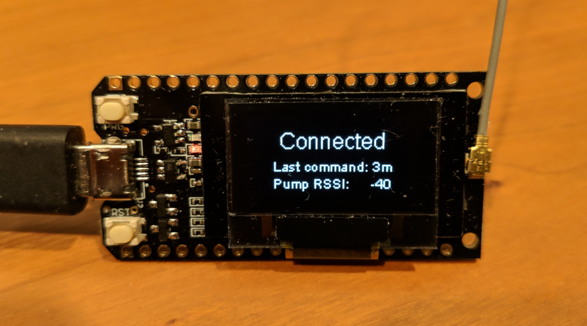

# GNARL is Not A RileyLink



## Warning

This repository contains **very preliminary** code, intended for
collaboration among developers. It **is not ready** for end users
and may be subject to rebasing without notice.

## Hardware

This project has been developed and tested on
a TTGO ESP32 868/915 MHz LoRa OLED module *(version 1 only, see below!),*
which contains an ESP32 SoC, an RFM95 LoRa radio,
a 128x64 pixel SSD1306 OLED display, and a LiPo battery charger.

The module has two push-buttons.
One is hard-wired to reset the board;
the other is available as an input or interrupt source.

They are available from [AliExpress,](https://www.aliexpress.com/item/2pcs-TTGO-LORA32-Lora-868Mhz-ESP32-LoRa-OLED-0-96-Inch-Blue-Display-Bluetooth-WIFI-ESP/32839249834.html)
[Banggood,](https://www.banggood.com/2Pcs-Wemos-TTGO-LORA32-868915Mhz-ESP32-LoRa-OLED-0_96-Inch-Blue-Display-p-1239769.html)
and numerous others.

### *TTGO version 2 module is not supported*

The current code does not work on the TTGO version 2 module due to
different pin assignments.

## Radios

The ESP32 SoC contains both WiFi and Bluetooth radios.
This project currently uses only the Bluetooth LE support.

The radio chip ([HopeRF RFM95](https://www.hoperf.com/modules/lora/RFM95.html) /
[Semtech SX1276](https://www.semtech.com/products/wireless-rf/lora-transceivers/sx1276))
is marketed for LoRa applications, but also supports OOK and FSK modulation.
The OOK capability is used by this project to communicate with Medtronic insulin pumps.
It may also be possible to use the FSK support and a 433 MHz version
of the module to communicate with OmniPod insulin pumps:
if anyone pursues that, please let me know.

## Hardware Setup

### Antenna

Attach an appropriate antenna to the U.FL connector on the module
before using this software.

### Power

The module can be powered via the micro-USB connector or with a 3.7V
LiPo battery.

The battery connects to a 2-pin female JST 1.25mm connector.
Note that this is smaller than the 2.0mm connectors used on Adafruit and
SparkFun LiPo batteries.

## Software Setup

### Initialize git submodules

This repository contains git submodules (in the `components` subdirectory).
Unless you cloned this repository with the `--recursive` option,
those submodules won't be initialized yet.
Use this command to initialize them:
```
git submodule update --init --recursive
```

and this command to check their status:
```
git submodule status --recursive
```

### Set up the ESP32 environment

1. [Follow these instructions to install the ESP-IDF development environment.](https://docs.espressif.com/projects/esp-idf/en/latest/get-started/index.html#installation-step-by-step)

1. Build and flash one of the example applications to make sure you have a working setup.

## Building GNARL

1. Type `make` in the top level of this repository

1. Change to the `project` subdirectory

1. Build the project by running `make -j`

1. Flash the project to your ESP32 module by running `make flash`

## Running GNARL

Run [Loop](https://loopkit.github.io/loopdocs/) on your iPhone
or run the [dev branch of AndroidAPS](https://github.com/MilosKozak/AndroidAPS) on your Android phone.
GNARL should show up when you scan for a RileyLink.

GNARL will show messages on the OLED display when your phone
connects and disconnects. Pushing the button will display the current
status. GNARL may not respond to the button press immediately if it is
communicating with the pump, due to scheduling priorities.

## Building the other applications

This repository contains a few applications ("projects" in ESP-IDF terminology) besides GNARL:

* `blink` blinks the onboard LED

* `sleep` uses the ESP32 "lightweight sleep" mode and wakes up when a
  timer goes off or the button is pressed

* `oledtest` draws text in various sizes on the OLED display

* `regtest` reads the RFM69 registers and prints them on the serial console

* `sniffer` receives Medtronic packets and prints them on the serial console

* `pumpstat` displays the status of a Medtronic insulin pump when you press the button

* `bletest` is a simple BLE server that can be queried with a tool like
  [nRF Connect](https://www.nordicsemi.com/Software-and-Tools/Development-Tools/nRF-Connect-for-mobile)

* `mmtune` finds the frequency at which the pump responds
  with the strongest signal and displays the results graphically

* `pumpclock` retrieves the time from a Medtronic insulin pump and
  uses it to display a digital clock

* `wifi` connects to a WiFi network, obtains an IP address, and prints
  it on the serial console

* `nightscout` retrieves recent entries from a Nightscout server and
  prints them on the serial console

To build the `blink` application, for example:

1. In the top level of this repository, type `make blink`

1. Change to the `project` directory and follow the same steps as above
   for building and flashing (`make -j` and `make flash`)

After flashing applications that print information on the serial console,
run `make monitor` to see the output.

### Pump-specific configuration

Some of the applications require the pump serial number or frequency
to be defined in the `include/pump.h` file.
It should look like this:

	#define PUMP_ID		"123456"	// pump serial number (note that this is a string constant)
	#define PUMP_FREQUENCY	916500000	// pump frequency
	#define MMTUNE_START	916300000	// starting frequency for mmtune scans

### WiFi configuration

The WiFi configuration is hard-coded in the `include/wifi_config.h` file as follows:

	#define WIFI_SSID	"network name"
	#define WIFI_PASSWORD	"network password"

### Nightscout configuration

Nightscout server information is defined in`include/nightscout_config.h` as follows:

    // DNS hostname, not a URL
	#define NIGHTSCOUT_HOST		"your.nightscout.hostname"

    // 40-character SHA-1 hash of your Nightscout API secret
	#define NIGHTSCOUT_API_SECRET	"0123456789abcdef0123456789abcdef01234567"

The SSL layer requires the root certificate used by the Nightscout
server to be available at compile time in the file `include/root_cert.pem`.
You can extract it from the output of this command:

    openssl s_client -showcerts -connect NIGHTSCOUT_HOST:443 </dev/null

The root certificate is the last one in the chain.

### Time zone configuration

The local time zone is hard-coded in the `include/timezone.h` file.
For example:

    #define TZ	"EST5EDT,M3.2.0/2,M11.1.0"

The time zone must be in one of the first two formats
[specified here.](https://www.gnu.org/software/libc/manual/html_node/TZ-Variable.html)
In particular, the "America/New_York" format is *not* supported.
